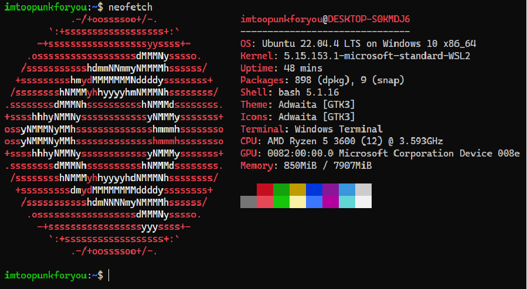
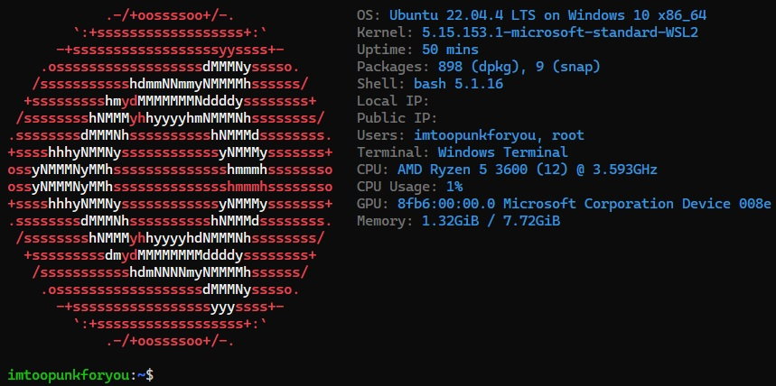
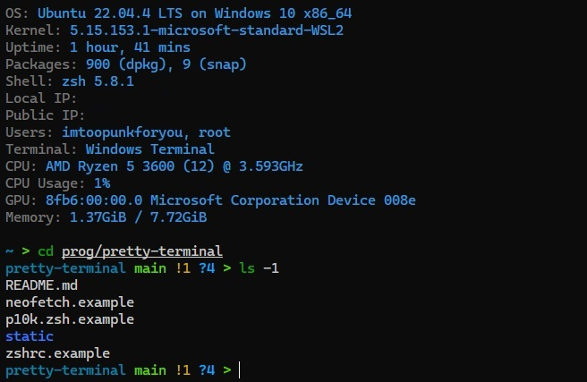

# Make pretty terminal
A short guide to setting up the terminal.

The instructions are written in Ubuntu, but work just as reliably on Fedora.
Also relevant for WSL2.

## Сommand-line system information tool
The first step you need to do is install <b>command-line system information tool</b>.
I use [neofetch](https://github.com/dylanaraps/neofetch).

<u>Steps:</u>
1. `sudo apt update`
2. `sudo apt install neofetch`


Now if you type `neofetch` in terminal you will see this:
    

I love minimalistic style: without logo or picture, without info about colors and theme.
I also add info about ip, cpu and users.
I change the colors to blue.

Let's configure:
1. Open `${HOME}/.config/neofetch/config.conf`
2. Comment out:
    - `info title`
    - `info underline`
    - `info "Theme" theme`
    - `info "Icons" icons`
    - `info cols`
3. Uncomment:
    - `info "Local IP" local_ip`
    - `info "Public IP" public_ip`
    - `info "Users" users`
    - `info "CPU Usage" cpu_usage`
4. Replace:
    - `memory_unit="mib"` to `memory_unit="gib"`
    - `colors=(distro)` to `colors=(4 6 1 8 8 6)`

After changes [neofetch](https://github.com/dylanaraps/neofetch) look like this:
    

The resulting configuration file can be [viewed here](#the-work-is-finished).
To remove the logo you need to run neofetch with the `--off` option.
Let's come back to this later.

## ZSH and Oh My Zsh

Now we need to install [ZSH](https://www.zsh.org/) and [Oh My Zsh](https://github.com/ohmyzsh/ohmyzsh).

### ZSH:
```bash
sudo apt install zsh
```
When prompted to set ZSH as the default shell, press `Y` to confirm.

### Oh My Zsh:
```bash
sh -c "$(curl -fsSL https://raw.githubusercontent.com/ohmyzsh/ohmyzsh/master/tools/install.sh)"
```

### Syntax highlighting:
```bash
git clone https://github.com/zsh-users/zsh-syntax-highlighting.git $ZSH_CUSTOM/plugins/zsh-syntax-highlighting
```

Let's connect the backlighting plugin in the `~/.zshrc` file:
- Replace `plagins=` to `plugins=(git zsh-syntax-highlighting)`.

### Install pretty theme [Powerlevel10k](https://github.com/romkatv/powerlevel10k):
```bash
git clone https://github.com/romkatv/powerlevel10k.git $ZSH_CUSTOM/themes/powerlevel10k
```

Replace (or add) in the `~/.zshrc`:
- `ZSH_THEME="powerlevel10k/powerlevel10k"`
- `POWERLEVEL9K_MODE="nerdfont-complete"`

## Configure theme
1. Reboot your terminal and configure theme with CLI.
2. Open `~/.zshrc` and add `neofetch --off` to first line.
3. Open `~/.p10k.zsh` and replace `typeset -g POWERLEVEL9K_SHORTEN_STRATEGY=truncate_to_unique` to `typeset -g POWERLEVEL9K_SHORTEN_STRATEGY=truncate_to_last` (Display only the current directory)

## Bat
[bat](https://github.com/sharkdp/bat) supports syntax highlighting for a large number of programming and markup languages.

Steps:
1. `sudo apt update && sudo apt install bat`
2. Add alias to `~/.zshrc`:
    ```bash
    alias cat="batcat"
    # alias cat="batcat --paging=never"
    ```
If you intend to alias `cat` to `bat` in your shell configuration, you can use
alias `cat='batcat --paging=never'` to preserve the default behavior.

## The work is finished
- My <code>[~/.zshrc](./zshrc.example)</code>
- My <code>[~/.p10k.zsh](./p10k.zsh.example)</code>
- My <code>[${HOME}/.config/neofetch/config.conf](./neofetch.example)</code>

    
